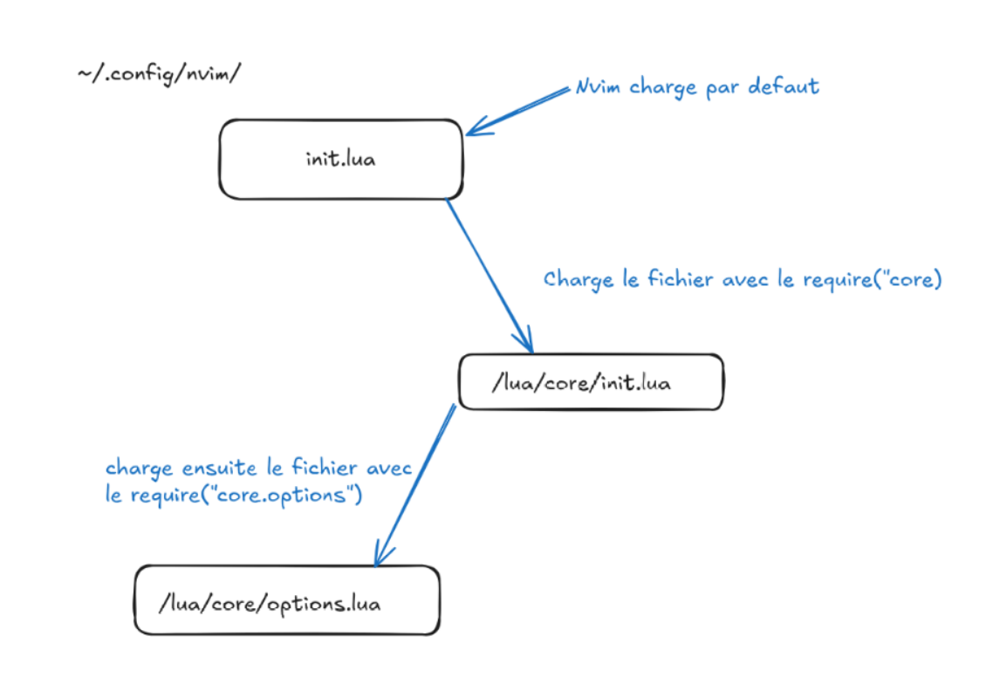

# NVIM

## Raccourcis

### Deplacement 
- `h` : gauche
- `j` : bas
- `k` : haut
- `l` : droite
- `ctrl + h` : fenetre de gauche
- `ctrl + l` : fenetre de droite
- `ctrl + j` : fenetre du bas
- `ctrl + k` : fenetre du haut
- `L` : changer vers buffer de droite (la barre du haut)
- `H` : changer vers buffer de gauche 
- `a` : insertion apres le curseur
- `I` : insertion en debut de ligne
- `A` : insertion en fin de ligne
- `o` : insere une nouvelle ligne en dessous de la ligne courante
- `O` : insere une nouvelle ligne au dessus de la ligne courante
- `r` : remplace les caracteres sous le curseur

### Mode 
- `i` : insertion 
- `v` : mode visuel 
- `;;` : sortie du mode insertion

### Nvim-Tree
- `espace + e` : ouverture/fermeture arborescence
- `a` : creation d'un nouveau fichier

### Lazy-vim
- `:Lazy` : ouvre la fenetre de gestion des plugins
- `q` : quitter 
- `U` : maj des plugins 

### Telescope
- `ctrl + k` : remonter dans la liste de selection
- `ctrl + j` : descendre dans la liste de selection
- `espace + ff` : cherche dans les noms de fichiers
- `espace + fg` : cherche dans le fichier
- `espace + fb` : cherche dans les noms de buffers
- `espace + fx` : cherche le mots sous le curseur dans le contenu des fichiers

### Treesitter
- `ctrl + espace` : demarre selection incrementale + extension de la selection
- `backspace` : reduire la selection

### Nvim-cmp
- `Ctrl + k` : selection element precedent de la selection
- `CTRL + j` : selection element suivant de la selection
- `Ctrl + b` : fais defiler la doc vers le haut
- `Crrl + f` : fais defiler vers le bas
- `Ctrl + espace` : ouvre le menu de completion
- `Ctrl + e` : ferme le menu de completion 
- `entree` : valide la sugestion ou la premiere si rien de selectionner

### LSP 
- `gR` : Affiche les references LSP
- `gD` : Aller a la declaration 
- `gd` : afficher les definitions LSP
- `gi` : affiche les definition de type LSP 
- `gt` : affiche les definitions de type LSP 
- `gs` : affiche l'aide de signature
- `espace + ca` : affiche les actions de code disponible 
- `espace + rn` : renommage intelligent 
- `espace + D` : affiche les diag du buffer
- `espace + d` : affiche les diag de la ligne courante 
- `[d` : aller au dig precedent 
- `]d` : aller au diag suivant 
- `K` : affiche la documentation sous le curseur 
- `F` : formate le buffer 
- `espace + rs` : redemarre serveur LSP 

## Structure

- `lua/core/init.lua` : fichier qui permet de charger les differents fichiers Core.
- `lua/core/keymaps.lua` : fichier qui contient les raccourcis clavier
- `lua/plugins/nvim-tree.lua` : configuration du plugins nvim tree
- `lua/plugins/telescope.lua` : configuration du plugin telescope
- `lua/plugins/bufferline.lua` : configuration bufferline
- `lua/plugins/lualine.lua` : configuration de la barre de status
- `lua/plugins/treesitter.lua` : configuration treesitter (ajout des language pris en compte)
- `lua/plugins/nvim-cmp.lua` : ajout de l'autocomplete

## Fonctionnement

Configuration de base pour Neovim

## Pluggins

- `lazy-vim` : permet de gerer l'installation et la configuration des pluggins.
- `nvim-tree` : arborescence des fichiers  
- `telescope` : permet de rechercher
- `bufferline` : affiche la barre des fichiers ouvers
- `lualine` : affiche la barre de status (info git)
- `nvim-treesitter` : parsing des languages de prog (coloration syntaxique, indentation intelligente)
- `nvim-cmp` : ajout de l'autocomplete

## Themes 

Pour ajouter de nouveau theme, creer un nouveau fichier `lua/plugins/<name_theme>.lua`

## Documentation 
- [Liste de theme](https://dotfyle.com/neovim/colorscheme/trending)
- [Guide de configuration](https://vincent.jousse.org/blog/fr/tech/configurer-neovim-comme-ide-a-partir-de-zero-tutoriel-guide/)
